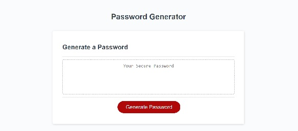

# Password Generator

## Description
This app generates random passwords with user input specifying password length and characteristics. Here is a link to the deployed page.

## Contributors
The JavaScript was created by Abigail Queen using a UC Davis Bootcamp (2022) starter code and a function shared on Stack Overflow [here] (https://stackoverflow.com/questions/1349404/generate-random-string-characters-in-javascript). The HTML and CSS were written by UC Davis Bootcamp (2022).
